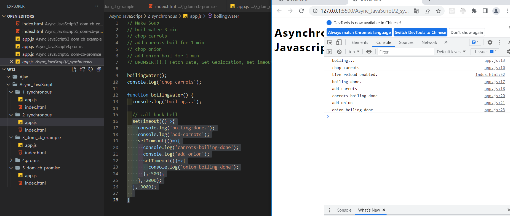
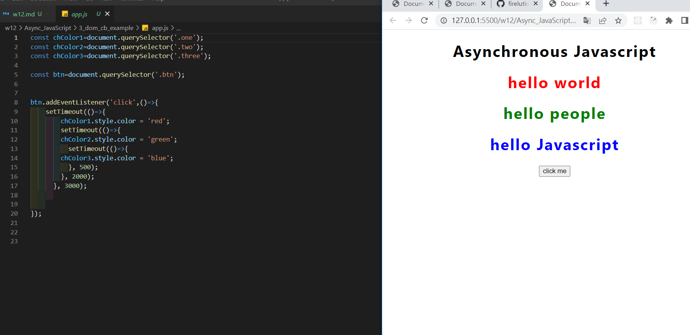
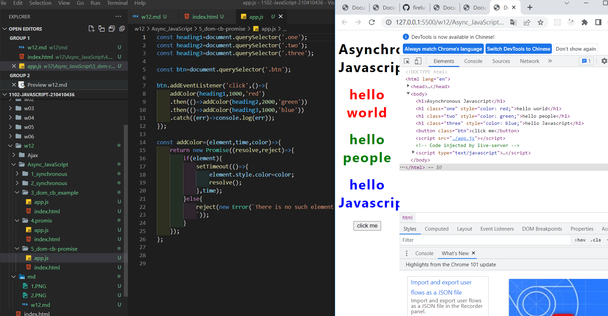
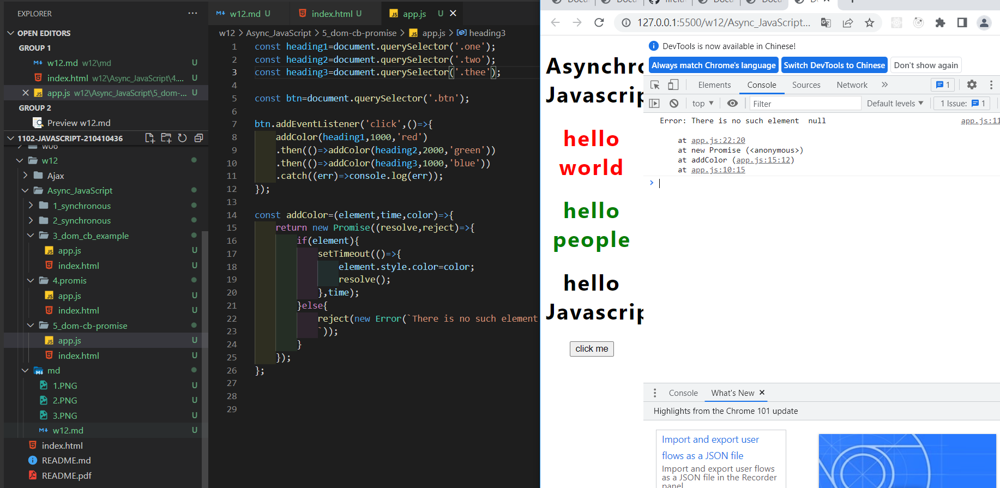
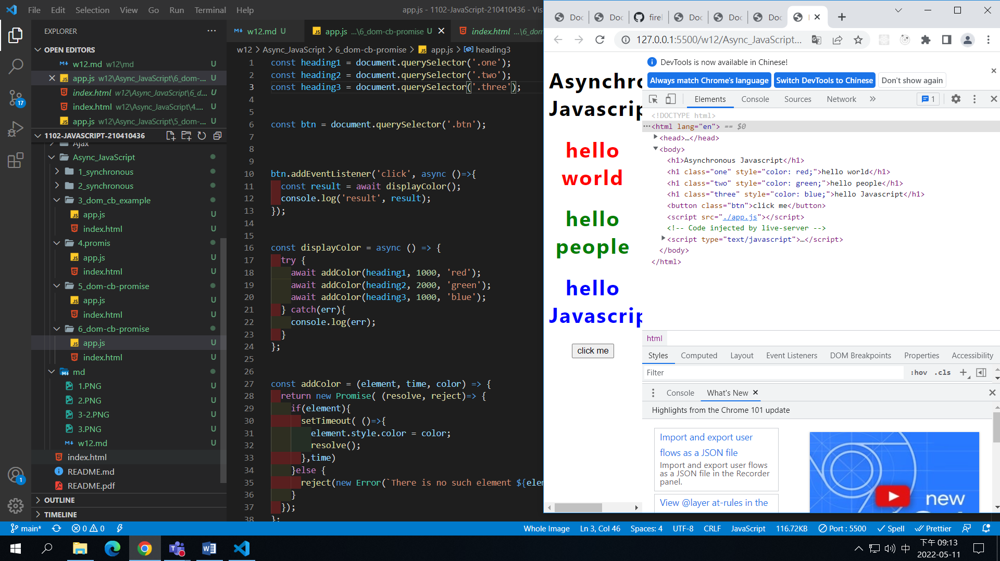
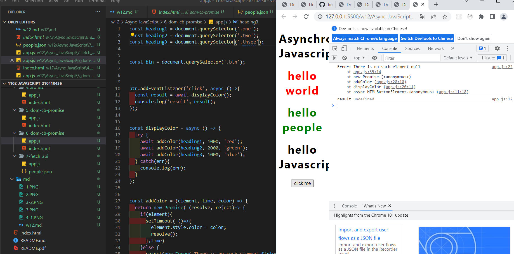
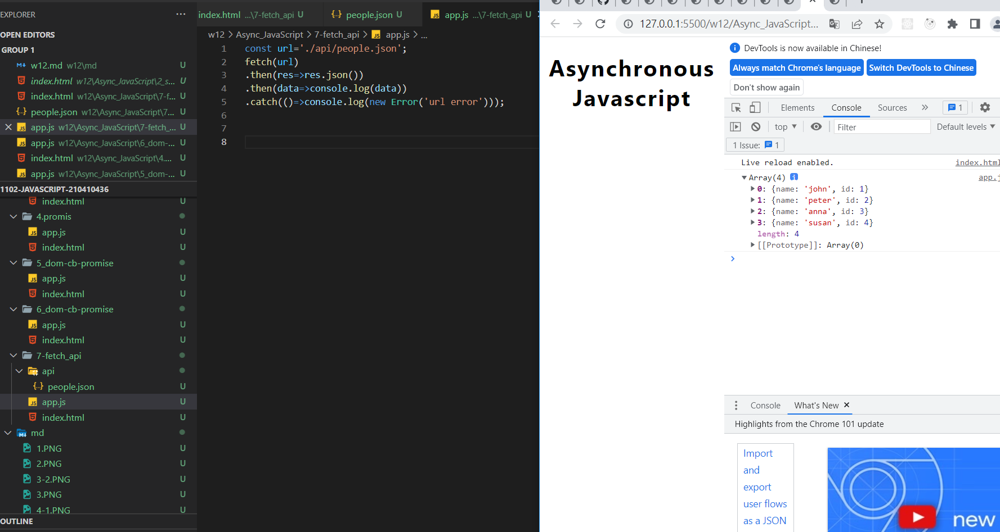

### W12-P1: Making soup demo for Async JavaScript with log info 

### w12-P2 DOM call-back functions demo -- colors change from red (1s), green (2s), blue (1s)

### w12-P3 use promise addColor(element,time,color) to solve-call back hell in w12-P2

### w12-P4 use async /await for w12-P3

### w12-P5 fetch people.json with 4 data show on console,change name to people1.json will result in error

